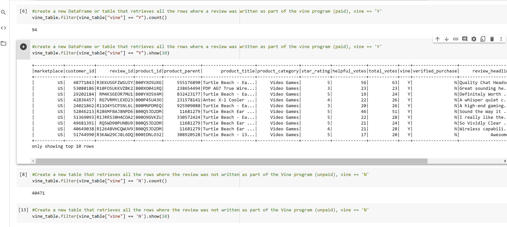

# Amazon_Vine_Analysis
## Overview of the Analysis

## Results
Using bulleted lists and images of DataFrames as support, address the following questions:

### How many Vine reviews and non-Vine reviews were there?
The best way to answer this question is to create a line of code that will count the total number of reviews that were part of the Vine program (paid) and a second line of code that will count the reviews that were not part of the Vine program (unpaid). In the picture below the process was completed:

### How many Vine reviews were 5 stars? 

### How many non-Vine reviews were 5 stars?

### What percentage of Vine reviews were 5 stars? 

### What percentage of non-Vine reviews were 5 stars?

## Summary 
In your summary, state if there is any positivity bias for reviews in the Vine program. Use the results of your analysis to support your statement. Then, provide one additional analysis that you could do with the dataset to support your statement.

Deliverable 3 Requirements
Structure, Organization, and Formatting (6 points)
The written analysis has the following structure, organization, and formatting:

There is a title, and there are multiple sections (2 pt)
Each section has a heading and subheading (2 pt)
Links to images are working, and code is formatted and displayed correctly (2 pt).
Analysis (14 points)
The written analysis has the following:

Overview of the analysis of the Vine program:

The purpose of this analysis is well defined (3 pt)
Results:

There is a bulleted list that addresses the three questions for unpaid and paid program reviews (7 pt)
Summary:

The summary states whether or not there is bias, and the results support this statement (2 pt)
An additional analysis is recommended to support the statement (2 pt)
