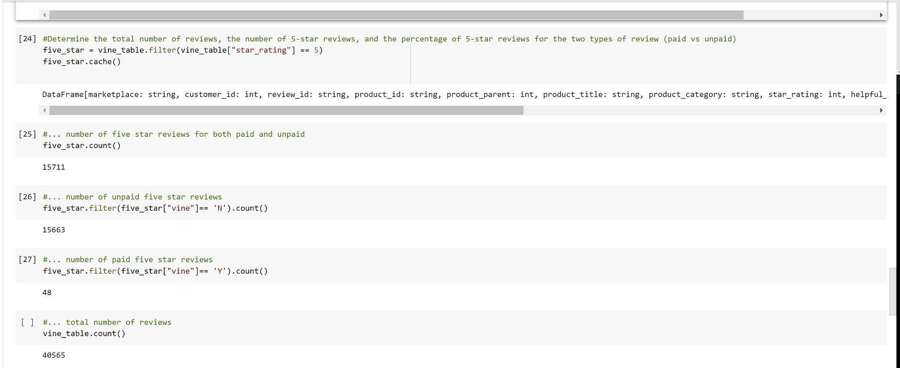
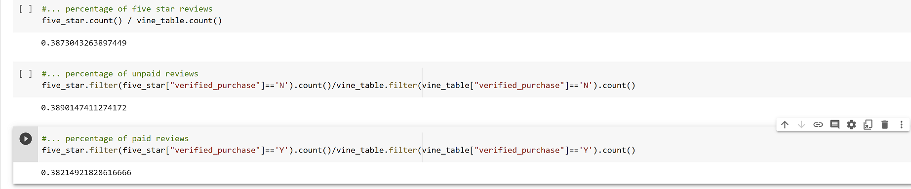

# Amazon_Vine_Analysis
## Overview of the Analysis

## Results
### Address the following questions to provide support for a reponse to the Summary question:

### How many Vine reviews and non-Vine reviews were there?
I believe the best way to answer this question is to create a line of code to count the total number of reviews that were part of the Vine program (paid) and a second line of code that will count the reviews that were not part of the Vine program (unpaid). In the photo below the process was completed:

As seen in cell 6 above the total number of reviews that were part of the Vine program (paid) are 94. Cell 8 displys the total number of reviews not a part of the Vine program (unpaid): 40,471.

### How many Vine reviews were 5 stars? 
The photo below displays the total number of 5 star reviews: 15,711 (cell 25). The number of 5 star Vine member reviews (paid) is 48 (cell 27).
### How many non-Vine reviews were 5 stars?
The photo also suggests there are 15,663 non-Vine (unpaid) 5 star reviews (cell 26).

### What percentage of Vine reviews were 5 stars? 
In the photo below 38.2% of the 5 star Vine (paid) reviews were reutrned in the analysis.
### What percentage of non-Vine reviews were 5 stars?
In the photo below 38.9% of the 5 star non-Vine (unpaid) reviews were returned in the analysis.

## Summary 
### Is there any positivity bias for reviews in the Vine program? 
This Vine analysis does not take into consideration whether or not those who left a review were able to view previous reviews of others before they made their own review of the video game. Positive reviews may influence others to also leave positive reviews or lessen the negative impact of the review. 

In the case of this analysis, the total percentage of five star reviews (all reviewers) is 38.73%. Over one-third of all video game reviews in the dataset are five star. The large percentage of 5 star reviews, 38.2%, by Vine program members, indicates the possibility of positivity bias. Even though both five star percentages are similar, 38.9% of non-Vine reviews are five star and 38.2% of reviews by Vine program members, only suggests to me that both populations, Vine members and non-Vine members, may be influenced by positivity bias.

One additional analysis I would suggest is more focused on language used by the reviewer to determine positivity bias. Is there a similarity in the laguage used by those who provided five star reviews? NLP (Natural Language Processing) would help with classifying text, extracting specific pieces of information related to five star reviews, and summarize the reviews to provide a helpful understanding if indeed there is a case for possitivity bias.

this concludes my analysis PEM
